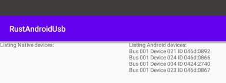

# RustAndroidUsb

This example project shows how to use Rusb with Android.

## Background

As root from the command line, Android behaves much like linux and libusb / rusb work normally. 

Unfortunately, when running as a regular app/apk Android creates a non-root, non-usb-group user and libusb fails to read from usbfs.

Fortunately, Android allows opening of USB devices via its UsbManager API, and once a device is opened, the file descriptor can be passed into libusb and things can continue normally.

This example Android app demonstrates enumerating USB devices in Android, then passing the file descriptors through JNI to Rusb, and printing some information about them.

## Result

